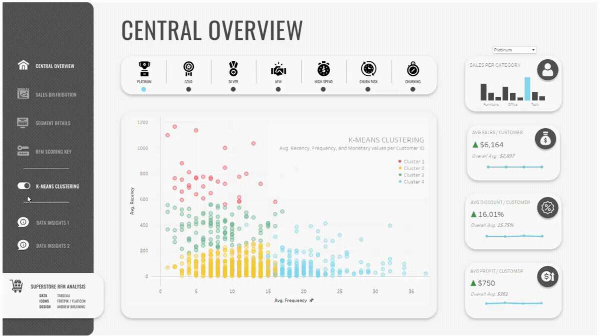
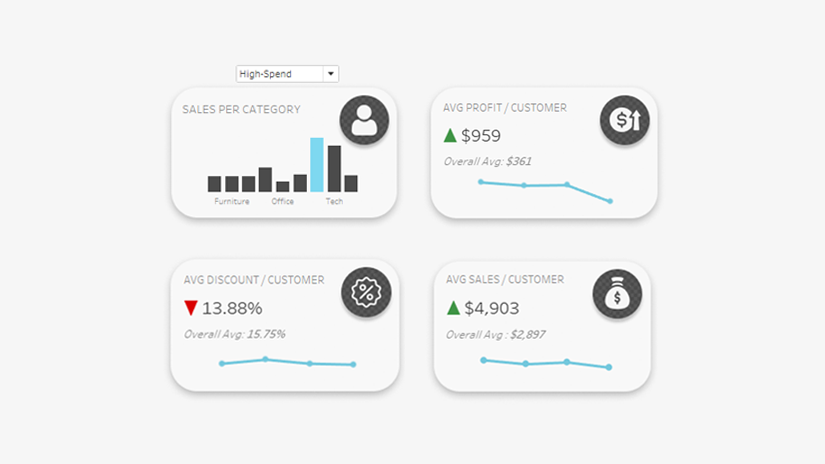
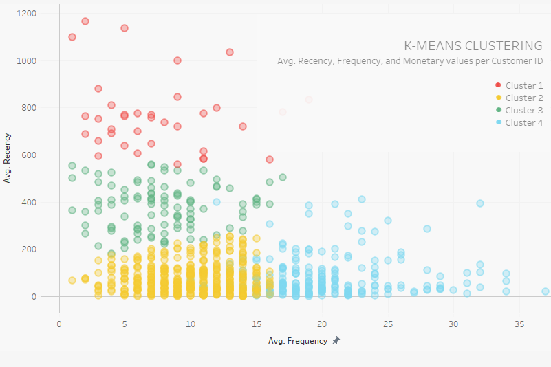
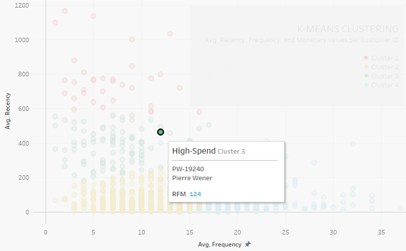
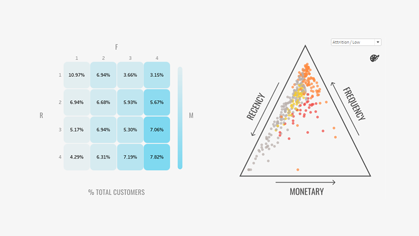
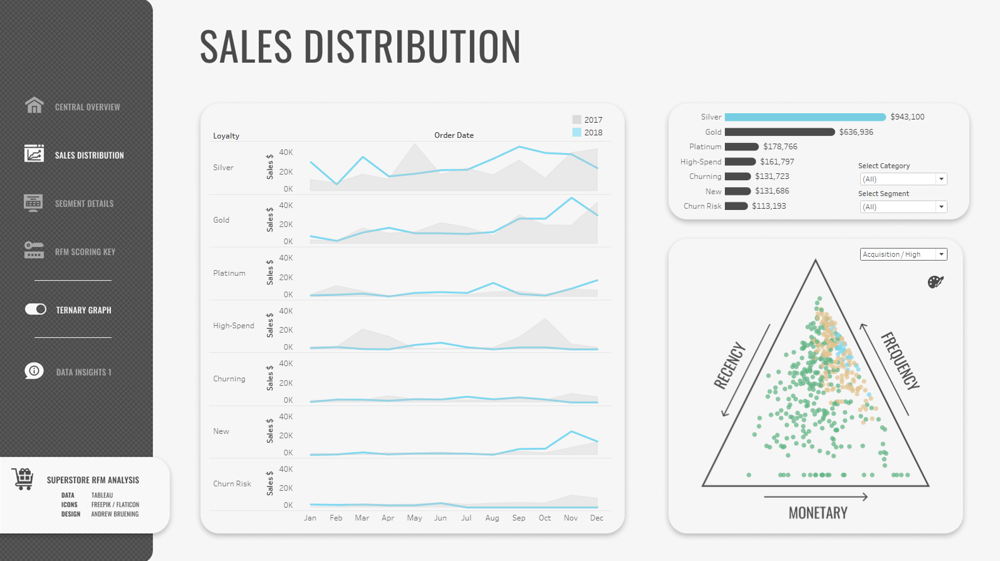
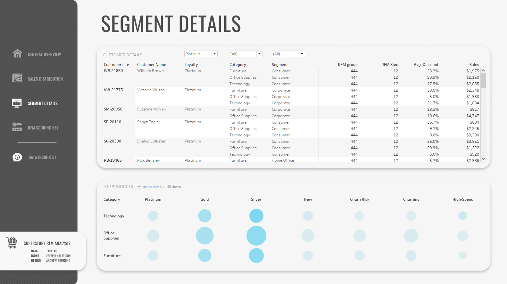

### Hey! I'm Andrew. Welcome to my [Github] 👋

- 📊 Data visualization is my forte. See my [Tableau] page! 
- 🚀 Most of what you see here is Tableau, Python, and Figma
- 🧠 I'm interested in how our social climate and media trends influence BI decisions
- ⛳ A nice quote: "If it's worth doing, it's worth doing well"

## RFM Customer Segmentation in Python and Data Visualization in Tableau

This readme includes various screenshots, but you can see the actual dashboard [here].

## Approach
1. The dataset required basic data cleaning and restructuring via Python. RFM modeling was done by manually assigning customer loyalty groups to various combinations of R/F/M values ranked from 1-4 (4 being the highest).
 
    >   1. Use lambda functions to establish Recency/Frequency/Monetary columns
    >   2. Split columns into quantiles with df.quantile
    >   3. Define two custom functions for scoring through 1-4
    >       - One function for R scoring, and one for F/M scoring
    >   4. Apply functions to previously created columns to form new R/F/M *scored* columns
    >   5. Use *for* loop to segment RFM varieties into customer loyalty groups
2. The dashboard was designed in Figma and built in Tableau. It includes the loyalty groups *(next section)* as well as a visualization detailing k-means clustering.
3. Insights were derived from various graphs in the dashboard and noted in both the **data insights** section of this readme, and the tooltips within the dashboard's sidebar.

## Customer Segmentation and RFM Modeling

The dashboard displays a scatter plot of k-means clusters at the level of Customer-ID. K-means aside, we've also used a segmentation model to categorize our customers into various "loyalty" segments. (*see Python notebook for code*)

| Loyalty | Requirement | Score e.g. | Tier | Description |
| :--------- | :--------- | :--------- | :--------- | :--------- |
| **Platinum** | All scores = 4 | 444 | High | highest-scoring, most loyal customers
| **Gold** | All scores >= 3 | 333, 344 | High | very loyal, second only to Platinum
| **Silver** | Moderate R/F/M | 133, 324 | High | represents the dependable majority
| **New** | High R; Low M | 411, 431 | Low | made their first purchase recently, or their first purchase in a very long time
| **High-Spend** | High M; Low R/F | 113, 214 | Low | top 25% of sales, large purchases but very infrequent, not considered loyal
| **Churn Risk** | Moderate M/F; Low R | 122, 133 | Low | no recent purchases, at risk of defecting to competition
| **Churning** | Low R/F/M | 111, 112 | Low | lowest RFM values, likely receptive to competitor-focused targeting

## Data Insights

**High-Spend Corporate Tech**

Initially, it was assumed that many High-Spend customers were one-off bargain-shoppers. 
After reviewing our data, we arrived at a different conclusion. 

- The average discount of High-Spend customers was well below the mean: 13.88% < 15.75%. 

- It was more than just promotions that attracted these customers.

- High-Spend customers strongly preferred Corporate and Consumer Tech products over other categories and segments. Corporate customers likely came became one-time purchasers when outfitting their properties with our products. This knowledge will give us the precision to target these customers more successfully.

**Grouping and Clustering**

These graphs aim to give perspective to the varying loyalty groups as we compare and contrast them. Similar to RFM scores, clusters are graded on an increasing scale from 1-4..

- Silver and Gold are the most influential groups with regards to total profit. Platinum and High-Spend are the most valuable per customer.

- K-means clustering displays the variance within groups and where they overlap. 

- Parts of High-Spend, Silver and Churn Risk all belong to Cluster 3 (hover to see tooltip) - our model interprets each group to be statistically similar to a certain degree. With proper targeting, Silver is a group we'd aim to grow and maintain. A future comparison will ideally show the "fringe" customers of High-Spend and Churn Risk to have ultimately moved into the Silver group. 

**Distribution Comparisons**

The ternary graph illustrates customer representation per RFM score.
Switch the graph to off to view the distribution as a matrix.

- The dropdown menu above the ternary graph filters results by loyalty groups. The High and Low options reflect the tiers of each group and correspond to a column value in the RFM Scoring Key.

- Color saturation in the RFM matrix is directly correlated to monetary (M) values of each cell. While the lowest RFM scores (111) reflect low monetary values, Churning still represents 10% of our customers.

**YoY Comparison**

In November and December of 2018, Churning customers were responsible for a total of $0.00 in sales.

- This is a sign that we need to conduct our customer retention efforts differently - especially during the holiday season. 2017 performance during these same months was much higher, mostly due to Consumer Furniture purchases.

**B2C Prioritization**

The spreadsheet below elaborates on specific values per Customer ID.
The size table illustrates categories and segments by proportion of sales.

- A large portion of Gold and Silver sales are derived from Consumer products of all segments. Home Office products are consistently the least successful products across the board.

- We previously touched on the success of Corporate and Consumer Technology with High-Spend customers. While a new emphasis on B2B may seem enticing, Corporate Technology sales do not account for a large enough portion of our total sales in order for us to pivot our strategy in that direction. Consumer products should still remain our primary focus.

## See the complete interactive dashboard [here]

[Tableau]: https://public.tableau.com/app/profile/andrew.bruening
[Github]: https://github.com/andrewbruening 
[dashboard]: https://public.tableau.com/app/profile/andrew.bruening/viz/SampleSuperstoreRFMCustomerSegmentation/CentralDB
[here]: https://public.tableau.com/app/profile/andrew.bruening/viz/SampleSuperstoreRFMCustomerSegmentation/CentralDB
