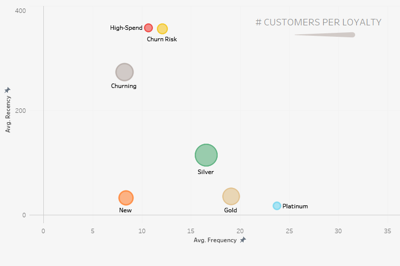

### Hey! I'm Andrew. Welcome to my [Github] 👋

## RFM Customer Segmentation in Python and Data Visualization in Tableau

- 📊 Data visualization is my forte. See my [Tableau] page! 
- 🚀 Most of what you see here is Tableau, Python, and Figma
- 🧠 I'm interested in how our social climate and media trends influence marketing needs
- ⛳ A nice quote: "If it's worth doing, it's worth doing well"

This readme includes various screenshots, but you can see the actual [dashboard] here.

## Approach

1. The dataset required basic data cleaning and restructuring via Python. RFM modeling was done by manually assigning customer loyalty groups to various combinations of R, F, And M values ranked from 1-4 (4 being the highest).
2. The dashboard was designed in Figma and built in Tableau. It includes the aforementioned loyalty groups as well as a visualization detailing k-means clustering.
3. Insights were derived from various graphs in the dashboard and noted in both the *data insights* section of this readme, and the tooltips within the dashboard's sidebar.

[Tableau]: https://public.tableau.com/app/profile/andrew.bruening
[Github]: https://github.com/andrewbruening 
[dashboard]: https://public.tableau.com/app/profile/andrew.bruening/viz/SampleSuperstoreRFMCustomerSegmentation/CentralDB