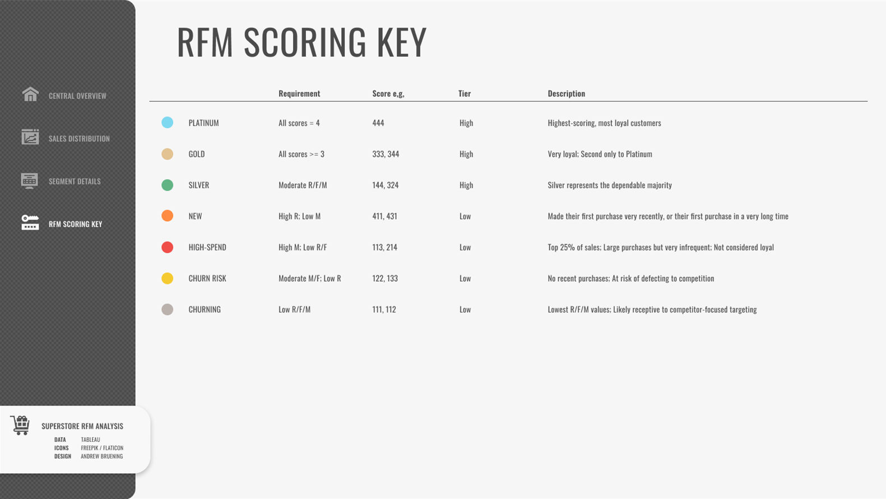

### Hey! I'm Andrew. Welcome to my [Github] 👋

## RFM Customer Segmentation in Python and Data Visualization in Tableau

- 📊 Data visualization is my forte. See my [Tableau] page! 
- 🚀 Most of what you see here is Tableau, Python, and Figma
- 🧠 I'm interested in how our social climate and media trends influence marketing needs
- ⛳ A nice quote: "If it's worth doing, it's worth doing well"

This readme includes various screenshots, but you can see the actual [dashboard] here.

## Approach
1. The dataset required basic data cleaning and restructuring via Python. RFM modeling was done by manually assigning customer loyalty groups to various combinations of R/F/M values ranked from 1-4 (4 being the highest).
2. The dashboard was designed in Figma and built in Tableau. It includes the aforementioned loyalty groups as well as a visualization detailing k-means clustering.
3. Insights were derived from various graphs in the dashboard and noted in both the **data insights** section of this readme, and the tooltips within the dashboard's sidebar.

## Customer Segmentation and RFM Modeling

The dashboard displays a scatter plot of k-means clusters at the level of Customer-ID. K-means aside, we've also used a segmentation model to categorize our customers into various "loyalty" segments.

-  are the highest-scoring, most loyal customers
-  customers are 
-  customers 
- 
| Loyalty | Requirement | Score e.g. | Description |
| :--------- | :--------- | :--------- | :--------- |
| 1. **Platinum** | All scores = 4 | 444 | highest-scoring, most loyal customers
| 2. **Gold** | All scores >= 3 | 333,344 | very loyal, second only to Platinum
| 3. **Silver** | Moderate R/F/M | 133,324 | represents the dependable majority
| 4. **New** | High R; Low M | 411,431 | made their first purchase recently, or their first purchase in a very long time
| 5. **High-Spend** | High M; Low R/F | 113,214 | top 25% of sales, large purchases but very infrequent, not considered loyal
| 6. **Churn Risk** | Moderate M/F; Low R | 122,133 | no recent purchases, at risk of defecting to competition
| 7. **Churning** | Low R/F/M | 111,112 | lowest RFM values, likely receptive to competitor-focused targeting

[Tableau]: https://public.tableau.com/app/profile/andrew.bruening
[Github]: https://github.com/andrewbruening 
[dashboard]: https://public.tableau.com/app/profile/andrew.bruening/viz/SampleSuperstoreRFMCustomerSegmentation/CentralDB